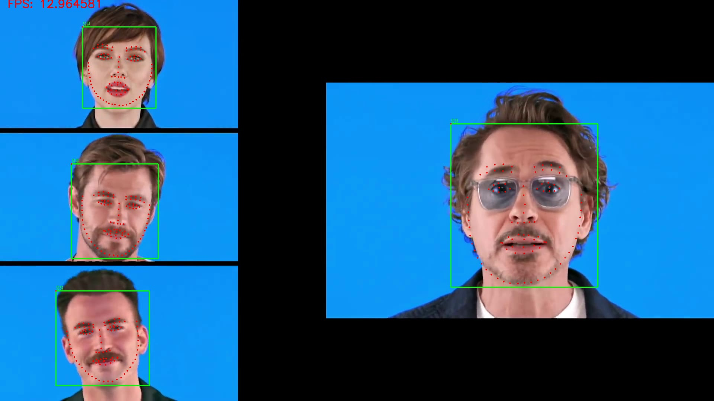
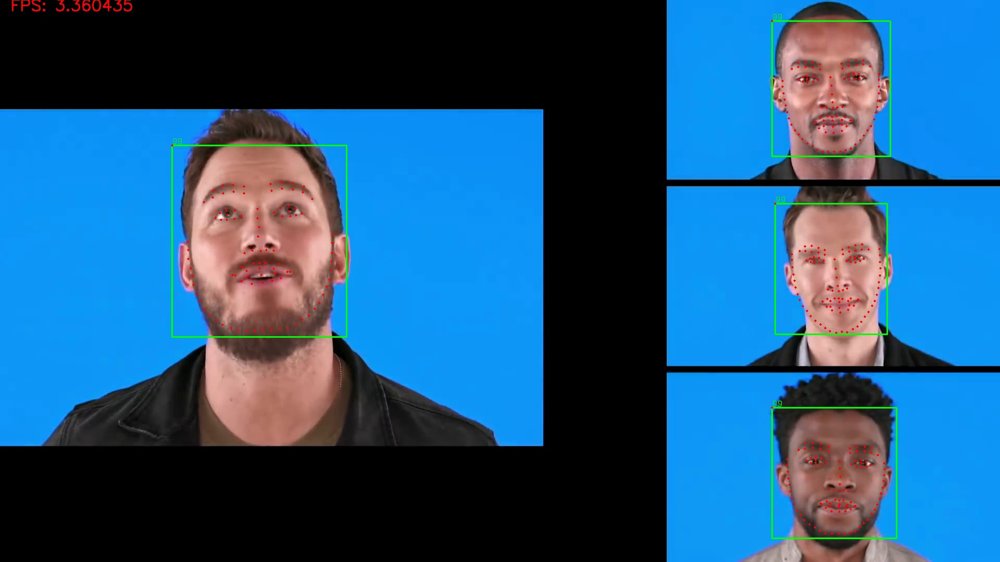
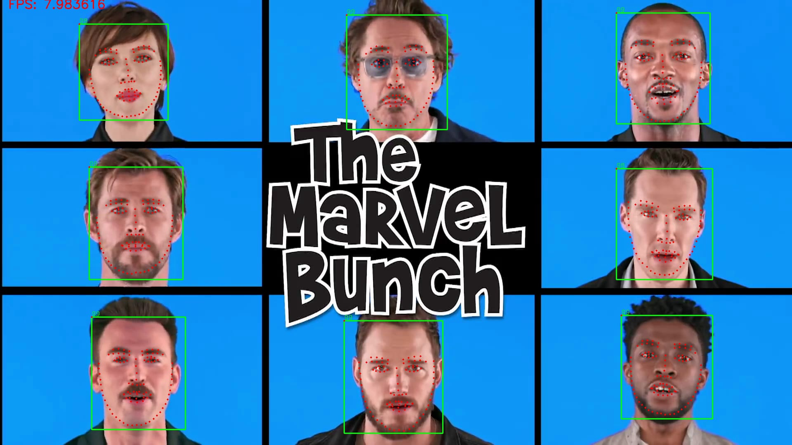

# pfld_106_face_landmarks
106点人脸关键点检测的PFLD算法实现

- [x] 😊[ncnn cpp推理代码 ](https://github.com/Hsintao/pfld-ncnn)

- [x] 转换后的ONNX模型

- [x] 预训练权重

- [x] 性能测试 

- [x] update GhostNet

- [x] update MobileNetV3 

  |     Backbone      | param |  MACC  |  nme  |              Link              | ONNX |
  | :---------------: | :---: | :----: | :---: | :----------------------------: | :--: |
  |    MobileNetV2    | 1.26M |  393M  | 4.96% |    [v2](checkpoint/v2/v2.pth)    | [v2.onnx](output/v2.onnx) |
  |    MobileNetV3    | 1.44M | 201.8M | 4.40% |    [v3](checkpoint/v3/v3.pth)    | [v3.onnx](output/v3.onnx) |
  | MobileNetV3_Small | 0.22M | 13M | 6.22% | [lite](checkpoint/lite/lite.pth) | [lite.onnx](output/lite.onnx) |

测试电脑MacBook 2017 13-Inch   CPU i5-3.1GHz (single core)
|   backbone    | FPS(onnxruntime cpu) |  Time(single face)  |
| :-----------: | :------------------: | :----: |
|    v2.onnx    |         60.9         |  16ms  |
|    V3.onnx    |         62.7         | 15.9ms |
| lite.onnx |        255        | 3.9ms |

-  Requirements

```python
    torch=1.2.0
    torchvision
    opencv-python
    tqdm
    onnxruntime==1.2.2
    numpy
```


- 数据集准备

  ```bash
  # 下载数据集到data/imgs下
  cd data
  python prepare.py
  ```
  ```bash
  # data 文件夹结构
  data/
    imgs/
    train_data/
      imgs/
      list.txt
    test_data/
      imgs/
      list.txt
  ```
  
-  训练

  ```bash
  CUDA_VISIBLE_DEVICES=0 python train.py --backbone=v3
  # 可选backbone为v2 v3 lite
  ```
  
- 结果 (MobileNetV2)

  
  
  
  
  
  
  
  
 - **Thanks**

https://github.com/polarisZhao/PFLD-pytorch

https://github.com/microsoft/onnxruntime

https://github.com/kuan-wang/pytorch-mobilenet-v3